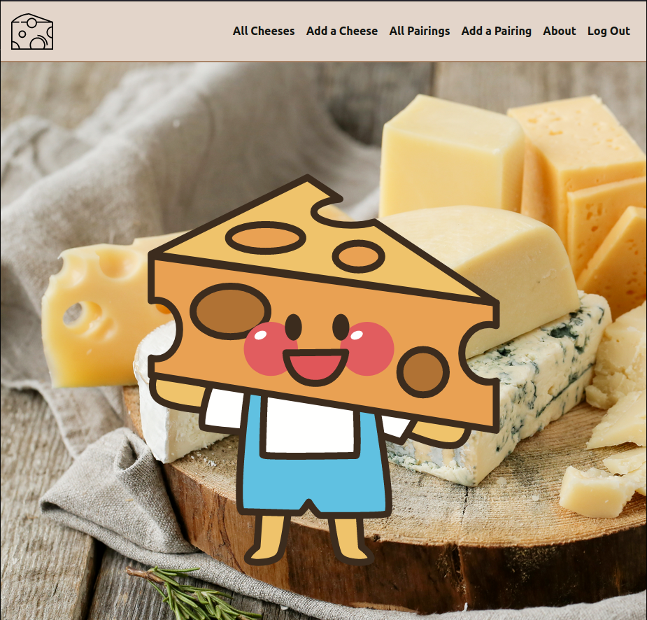

# CheeseBoard 

 
  

This is a Django application with Auth, focused on reviewing and sharing cheeses as well as pairings.
  
__ERD:__
  

  
__Deployed-Site:__

#### [CheeseBoard](https://cheese-board-sei.herokuapp.com/)
  
__Planning:__
#### [Trello](https://trello.com/b/vjkDVBxw/cheeseboard)